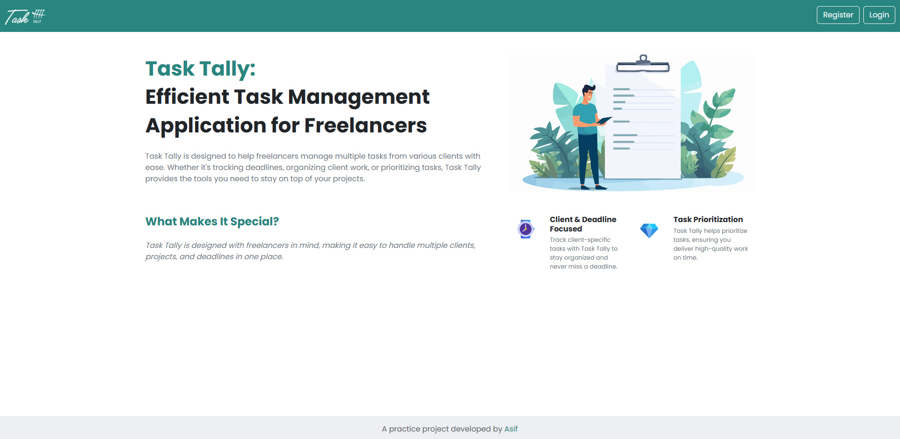
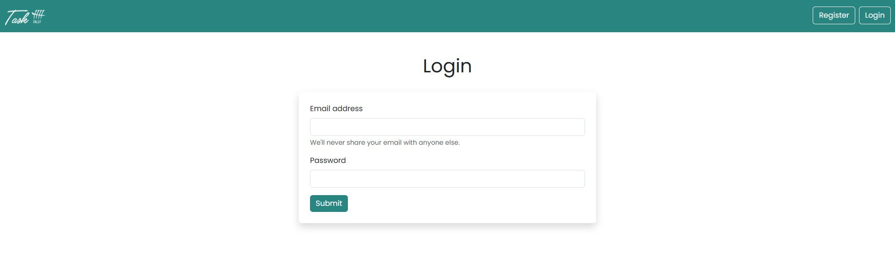
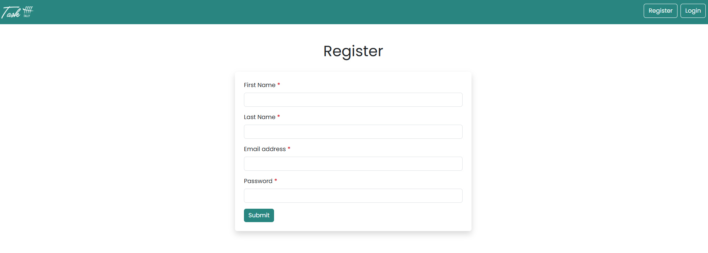
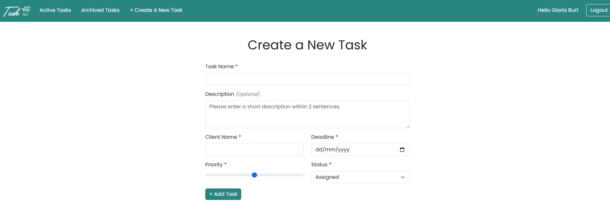
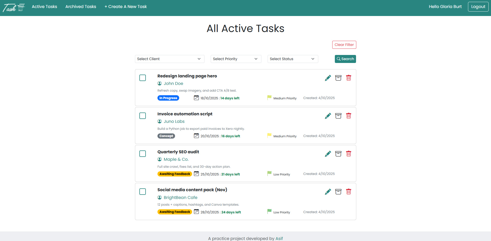
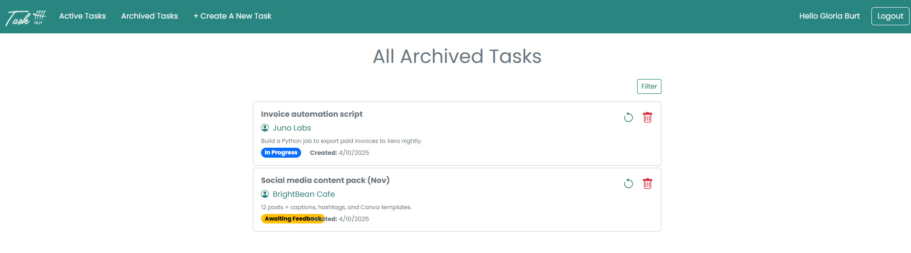

# Task Tally v1.0 ✅📅

Welcome to **Task Tally** — a clean, focused task manager built for **freelancers** juggling multiple clients, projects, and deadlines. Keep priorities clear, track progress, and ship on time — all in one place.

**Live demo:** 👉 **[Task Tally on Netlify](https://tasktallyv1.netlify.app/)**

---

## ✨ Highlights

- 👥 **Client-Centric Workflow** – Organize tasks by client so nothing slips through the cracks.
- ⏱️ **Deadline Countdown** – See time remaining (or if it’s passed) at a glance.
- 🔖 **Priorities that Pop** – Priority flags (Low / Medium / High) help you focus fast.
- ✅ **One-Click Completion** – Toggle a checkbox to mark tasks done.
- 🧭 **Smart Filters** – Filter by **Client**, **Priority**, and **Status** (Active / In Progress / Completed).
- 🗂️ **Archive & Restore** – Full task lifecycle management with an **Archive** page and filters.
- 🧰 **Full CRUD** – Create, read, update, delete tasks with friendly forms and validation.
- 🔐 **Auth Built-In** – **Firebase Authentication** for sign up, login, and protected pages.
- 📱 **Fully Responsive** – Looks great on phones, tablets, and desktops.

---

## 💡 Inspiration

As a full‑time freelancer, I constantly juggled changing requirements, shifting deadlines, and conversations across multiple clients. Keeping everything in a single text file didn’t scale — it was too easy to lose context or miss priorities. **Task Tally** was born from that pain: a lightweight, focused system where freelancers can **track client work, prioritize tasks, and monitor deadlines** without the clutter. If it helps you reclaim your focus and deliver with confidence, it’s doing its job. 🙌

---

## 🧩 Tech Stack

- **Vue 3** (Composition API)
- **Pinia** (state management)
- **Vue Router 4** (routing)
- **Firebase** (Email/Password Auth + **Realtime Database**)
- **Vue CLI 5** (build tooling)
- **Netlify** (hosting)

> Project name: **`task-tally-v1`**

---

## 🚀 Getting Started

### ✅ Requirements

- **Node.js** v16+
- **npm** (or yarn)

### ⏳ Installation

```bash
# 1) Clone the repo
git clone https://github.com/Md-Asifullah/task-tally-v1.git
cd task-tally-v1

# 2) Install dependencies
npm install

# 3) Environment setup (Firebase)
cp .env.example .env
# then edit .env (see below)

# 4) Run the app
npm run serve
# open the shown local URL (e.g., http://localhost:8080/)
```

---

## 🔐 Firebase (quick setup)

This project uses **Firebase Email/Password Auth** and the **Realtime Database**.

1. Create a Firebase project → enable **Email/Password** auth
2. (Optional) Create a Realtime Database if you want to test saving user info
3. Add this to your `.env`:

```bash
# .env (minimal)
VUE_APP_API_KEY=your_api_key
# Optional if you change the DB URL in code:
# VUE_APP_FIREBASE_DB_URL=https://your-project-default-rtdb.<region>.firebasedatabase.app
```

> This repo uses a hardcoded example DB URL in code (practice project).  
> If you fork it, either update the URL in code or set `VUE_APP_FIREBASE_DB_URL` and use it instead.

---

## 🧭 App Structure (at a glance)

- **Home / Dashboard** – Active tasks with filters & quick actions
- **Auth Pages** – Login / Registration (Firebase)
- **Create Task** – Form with validation and required fields
- **Archive** – List of archived tasks with Client/Status filters
- **Task Detail / Edit** – Full CRUD support

---

## 📝 Task Fields

**Create a New Task**

- **Task Name** (required)
- **Description** (optional, ≤ 2 sentences)
- **Client Name** (required)
- **Deadline** (required, `dd/mm/yyyy`)
- **Priority** (required: Low / Medium / High)
- **Status** (required: e.g., Assigned / In Progress / Completed / Archived)
- **Assigned** (assignee/user context)

**Nice touches**

- Priority flags on cards
- Live deadline countdown (and “deadline passed” indicator)
- Checkbox to mark as completed
- Archive / Restore actions

---

## 📸 Screenshots

Add screenshots to `src/assets/` and reference them here:

```md






```

---

## 🌐 Deployment

Hosted on **Netlify**  
**Live:** **[https://tasktallyv1.netlify.app/](https://tasktallyv1.netlify.app/)**

Local build:

```bash
npm run build
npm run serve   # for dev
```

Netlify tips:

- Build command: `npm run build`
- Publish directory: `dist`
- Configure all Firebase env vars in Netlify

---

## 🚀 Deploy your own (quick checklist)

1. Create a **Firebase Project**.
2. Enable **Email/Password** auth.
3. Create **Realtime Database** (select region).
4. Add a **Web App** and copy the config values.
5. Set **Authorized domains** (Netlify domain + `localhost`).
6. Add the **env variables** locally and on Netlify.
7. Apply the **DB rules** above.
8. `npm install && npm run serve` (local) / `npm run build` (deploy).

---

## 🧭 Browser Support

Targets modern browsers per `browserslist`:

```
> 1%
last 2 versions
not dead
not ie 11
```

---

## 👤 About the Author

Made with ❤️ by **[Md Asifullah](https://www.artisanasif.com/)** — Front-End Developer & Software Engineer.  
Got ideas or feedback? Let’s connect! 🚀

---

## 🪪 License

This project is for **learning and portfolio purposes**.  
Feel free to fork, explore, and experiment.

**Happy Tallying! 🎉**
